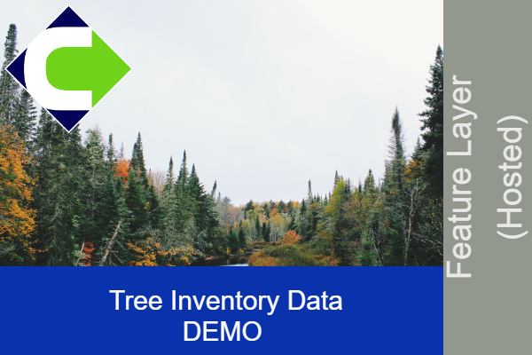

# ArcGIS Thumbnail Builder

The ArcGIS Thumbnail Builder is an intuitive web application for constructing
thumbnails for ArcGIS Online items, utilizing HTML5 canvas.

[View Live Application](https://dev.navigator.oregon.gov/agol/thumbnailbuilder/index.html?background=./img/gallery/boat.jpg&logo=./img/gallery/osmb.png&titleColor=111,166,166,0.7&title=Great%20White%20Shark%20Migratory%20Patterns&category=Feature%20Service&sidebarColor=166,17,3,0.7)

## Example Output Thumbnails

## Getting Started

There is no special setup required to run this application.  Just place the files on
a web server, locally or in production.  No other resources are required.  

## License

GNU General Public License v3.0
